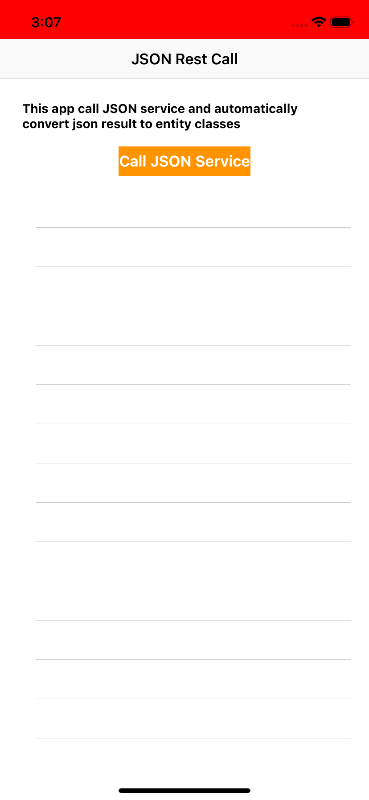

# SwiftRestServiceJSONDecoder
This app call Rest service and automatically convert result to Entity classes through JSONDecoder and Check internet connection availability, if no internet then change status bar color to red
1. download or clone https://github.com/abidanjum2019/SwiftRestServiceJSONDecoder.git
2. Open project in xcode
3. 

